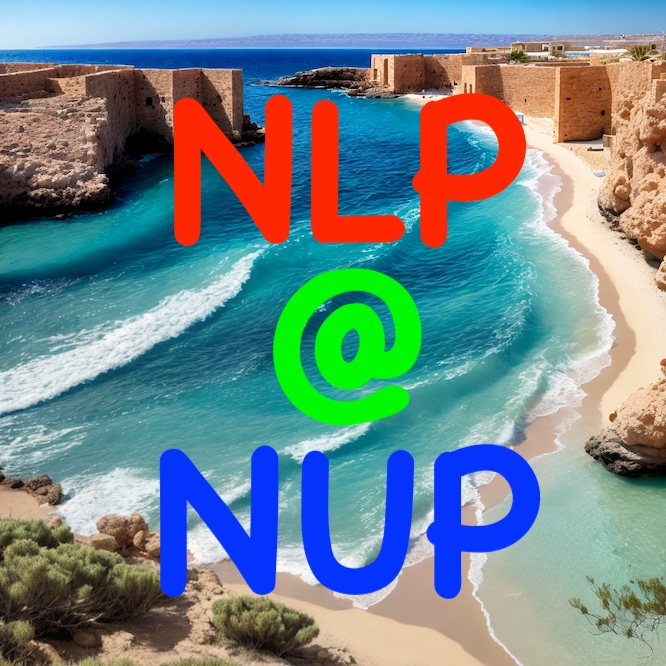
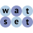

**Publications:** [Google Scholar](https://scholar.google.com/citations?user=wPD4g7AAAAAJ), [dblp](https://dblp.org/pid/148/4508)

<!-- https://plugins.jetbrains.com/files/22282/733664/icon/default.svg -->

<!-- https://raw.githubusercontent.com/dustalov/evalica/master/Evalica.svg -->

<!-- https://dustalov.github.io/nlpafos/NLP-at-NUP-Square.jpg -->

<!-- https://raw.githubusercontent.com/Toloka/crowd-kit/main/docs/Crowd-Kit.svg -->

<!-- https://raw.githubusercontent.com/nlpub/watset-java/master/src/main/javadoc/doc-files/Watset.svg -->

